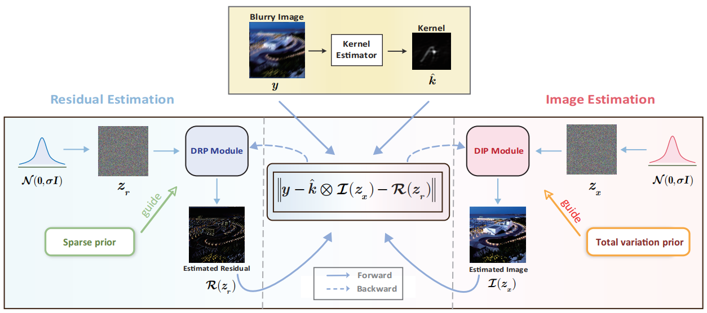
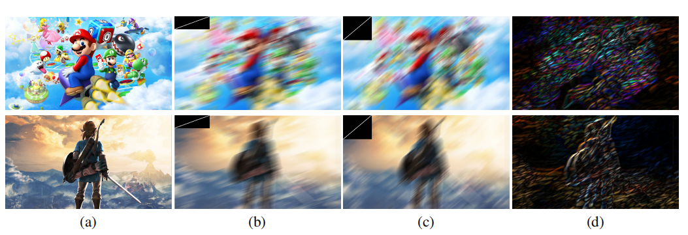
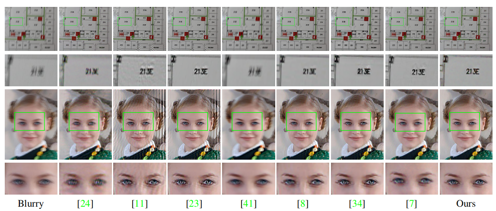
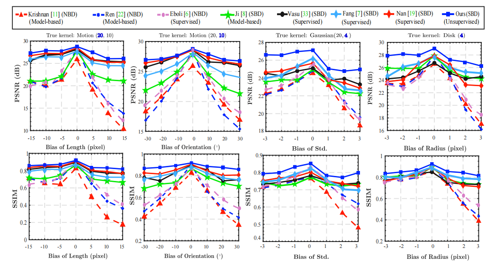

# Uncertainty-Aware Unsupervised Image Deblurring with Deep Residual Prior
This is the official `Python` implementation of the [CVPR 2023](https://cvpr.thecvf.com/)  paper **Uncertainty-Aware Unsupervised Image Deblurring with Deep Residual Prior**

The repository contains reproducible `PyTorch` source code for computing the deblurred image and residual given a single kernel and blurry image.

## Visualization of the kernel induced error (residual)

## Test on real blurry images from Lai dataset

## Robustness to the kernel error

If the inputs contain only blurry images, you will need to run some kernel estimation algorithm to obtain the kernel.
